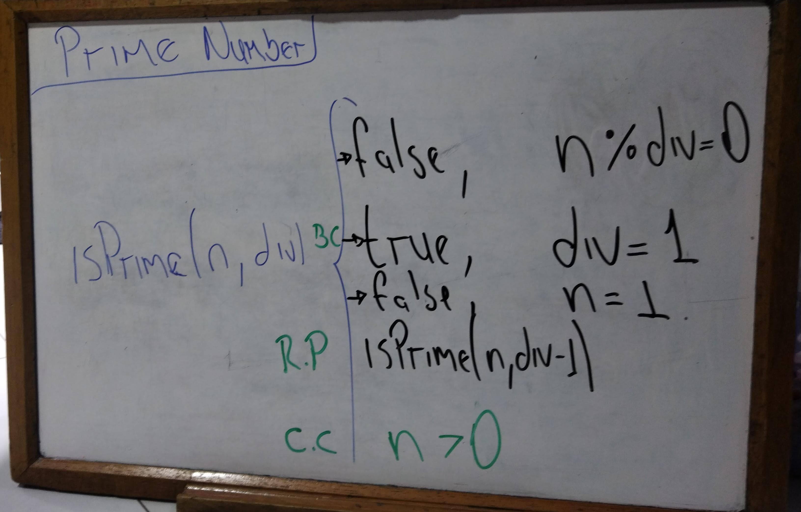

# Recursive Prime Number

This Java program evaluates if a number is prime or not using recursion.

---

## Program Explanation

### Base Case:

1. If `number <= 1`, the function returns `false` since numbers less than or equal to 1 are not considered prime.
2. If `div == 1`, it means no divisors other than 1 were found, and the number is prime, so it returns `true`.

### Recursive Case:

For values of `number > 1`, the function recursively calls `isPrime(number, div - 1)` and checks whether the number is divisible by `div`.  
The recursion gradually decreases `div` by 1 with each recursive call, eventually reaching the base case (when `div == 1`).

#### Recursion Formula:

isPrime(n, div) = if n <= 1 return false 
                  if n % div == 0 return false 
                  if n = 1 return false
                  if div == 1 return true isPrime(n, div - 1) // recursive call with div reduced by 1
                

## Input Handling and Loop

The program prompts the user to enter a number to check if it is prime.  
It uses a recursive method, where the second argument is a divisor that decreases with each recursive call.

- The number starts from `n - 1` (i.e., the largest possible divisor before checking divisibility).
- The loop ensures that if an invalid number (e.g., non-positive integer) is entered, the program will handle it accordingly.

---

## Whiteboard Thinking

For visualizing the recursion process, refer to the whiteboard diagram that illustrates how the recursive calls work for prime number checking.

-  - The image contains a visual representation of how recursion unfolds step-by-step.

---
