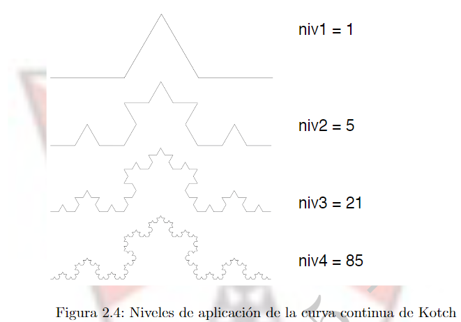

# Problem 95

Una de las cosas mas maravillosas de la naturaleza es la nieve, y en especial su partıcula mas pequena
que es el copo de nieve
Kotch ha planteado en su articulo “Acerca de una curva continua que no posee tangentes y obtenida por los metodos de la geometrıa elemental”, una manera interesante de describir un copo de nieve, que es una curva que se forma de tres partes iguales.

La forma de conseguir cada una de las partes es recurrente y considerando varios niveles de aplicacion de
la forma. En la figura 2.4, se muestra la forma que asume cada parte de la curva, considerando un nivel de profundidad:

Para nuestro problema, debes escribir una solucion recursiva que dado un nivel de aplicacion a la curva de Kotch me genere la cantidad de triangulos que se necesitan para generar una parte de la misma. En la [`Imagen de la figura`](./copo_de_nieve.png)

- Nivel 1 de aplicación: se requiere 1 triángulo.
- Nivel 2 de aplicación: se necesitan 5 triángulos.
- Nivel 3 de aplicación: se requieren 21 triángulos.
- Nivel 4 de aplicación: se necesitan 85 triángulos.

